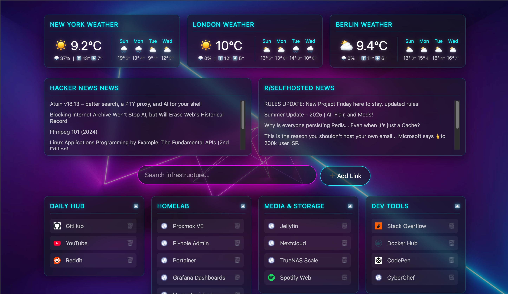
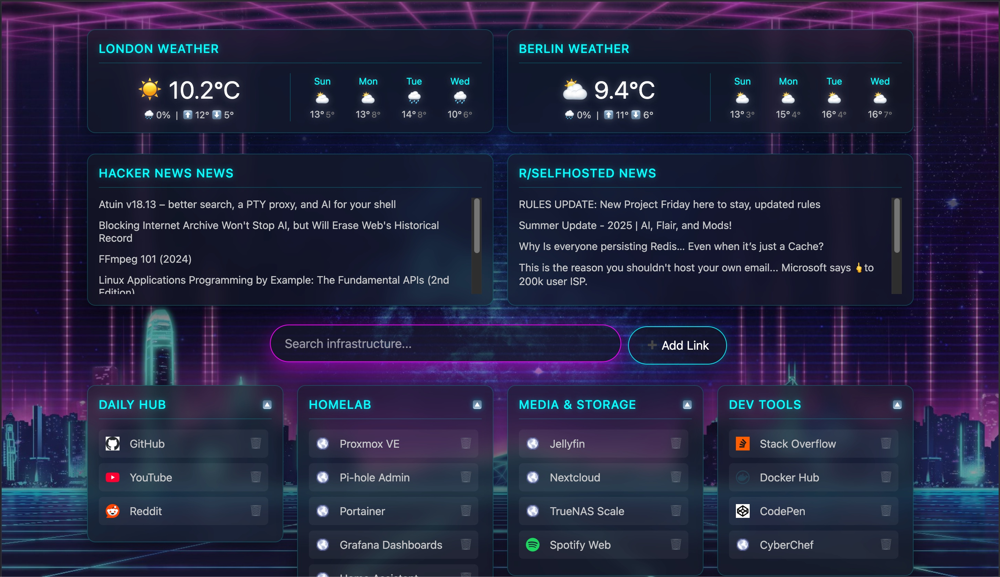
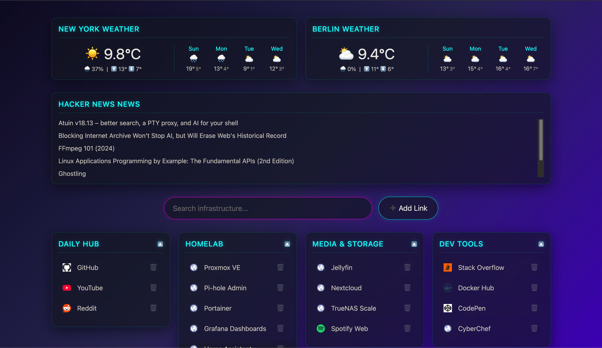

# 🌌 Neon Homelab Dashboard

A lightning-fast, ultra-lightweight, and fully customizable startpage for your homelab. Built with pure HTML/CSS/JS on the frontend and a snappy FastAPI backend for persistent storage. No React, no Node.js bloat, no complex YAML configurations—just a beautiful, hackable dashboard.





## ✨ Features

- **🎨 Pure Vanilla Frontend:** Zero build steps. The UI is incredibly responsive and uses a modern glassmorphism/synthwave aesthetic via CSS gradients.
- **🗂️ Interactive UI:** Add, delete, and reorder bookmarks directly from the browser. Drag-and-drop your links, and the FastAPI backend instantly saves the layout to your `config.json`.
- **🔍 The "Omnibox":** A highly engineered search bar that acts as a universal router:
  - **Ghost Autocomplete:** Press `Tab` to instantly complete local bookmark names.
  - **Direct Navigation:** Type a URL (e.g., `github.com`) and hit Enter to go straight there.
  - **Custom Shortcuts:** Use one-letter triggers (`g ` for Google, `y ` for YouTube, `m ` for Maps) to bypass standard search engines.
  - **Fallback Search:** Sends unrecognised queries to a search engine of your choice.
- **⛅ Dynamic Widgets:** Live 4-day weather forecasts (via Open-Meteo) and high-speed RSS feed parsing (via rss2json).
- **🖼️ Auto-Favicon Scraper:** The Python backend automatically crawls your saved URLs, bypasses local SSL warnings, and downloads favicons to your server so you don't leak DNS requests to Google's favicon API.

## 🚀 Quick Start

Spin up the entire stack using Docker Compose.

1. Clone the repository:

   ```bash
   git clone [https://github.com/Apollosport/neon-startpage.git](https://github.com/Apollosport/neon-startpage.git)
   cd neon-startpage
   ```

2. Start the containers:

   ```bash
   docker compose up -d
   ```

3. Open your browser and navigate to `http://localhost:8080`.

## ⚙️ Configuration

All user data is stored in `data/config.json`. You can edit this file manually, but it is highly recommended to use the UI's **"+ Add Link"** button and drag-and-drop features to let the backend handle the JSON formatting for you!

### Search Shortcuts

The Omnibox supports the following built-in shortcuts out of the box:

- `g <query>` - Google Search
- `gi <query>` - Google Images
- `y <query>` - YouTube
- `m <query>` - Google Maps
- `a <query>` - Amazon
- `t <query>` - Google Translate

_Want to add more? Just open `index.html`, locate the `setupSearch()` function, and copy/paste a new shortcut block!_

## ⚠️ Disclaimer & Liability

**This project was built primarily for personal homelab use.** It prioritizes speed and simplicity (like using `innerHTML` for rapid DOM updates) over enterprise-grade security sanitization. While perfectly safe for a self-hosted, single-user environment behind a firewall, it is **not** recommended to expose this dashboard to the public internet without proper authentication (like Authelia or Cloudflare Access).

By using this software, you acknowledge that it is provided "as is" without warranty of any kind. The author is not responsible for any broken configurations, data loss, or security vulnerabilities that may arise from its use.

---

_Built with ❤️ for the Self-Hosted community._
